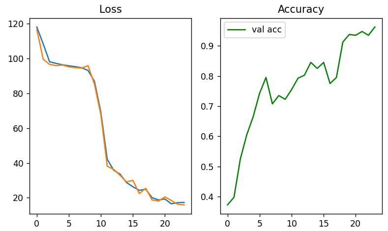
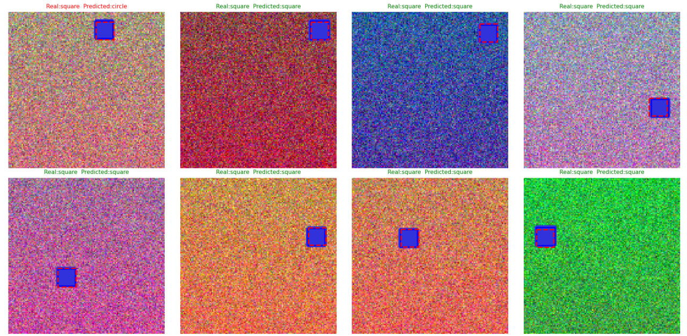
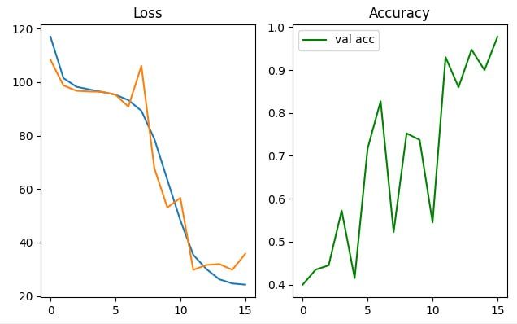
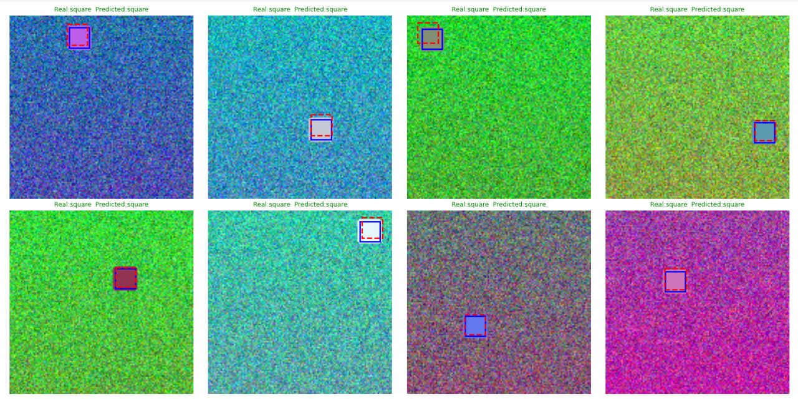
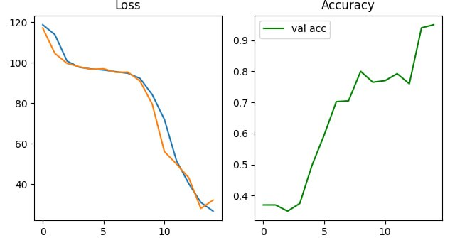
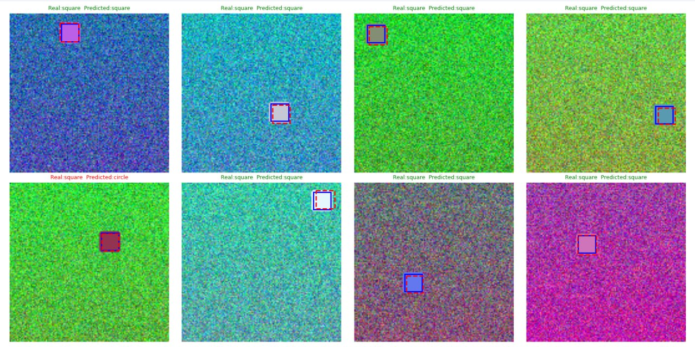

shapes_dataset

shapes_dataset_bg

shapes_dataset_random

## Вывод

Модель была обучена и протестирована на трех различных датасетах с одинаковым количеством эпох(Но ёрли стопин происходил раньше). По результатам тестирования можно сделать следующие выводы:

1. **`shapes_dataset` (Базовый датасет)**: Модель показывает средненькую точность, 1 ошибка из 8 тестовых изображений. В этом случае у модели преимущество: фон однородный, контуры фигур четкие, и сети очень легко извлекать полезные признаки (границы, углы) без постороннего шума, но, видимо, происходит переобучение. Обучение в этом случае было наиболее долгим, но устойчивым

2. **`shapes_dataset_bg` (Датасет с фоном)**: Показала наилучшую точность, 0 ошибок. Видимо, сеть лучше справляется с предсказанием положения фигур на однородном фоне. 

3. **`shapes_dataset_random` (Датасет со случайным шумом)**: 1 ошибка из 8 изображений, сеть оказалась достаточно устойчивой к такому типу помех. Но, видимо, из-за шума сложнее улавливать контуры фигур, поэтому сеть работает не так хорошо, как на двух предыдущих датасетах
